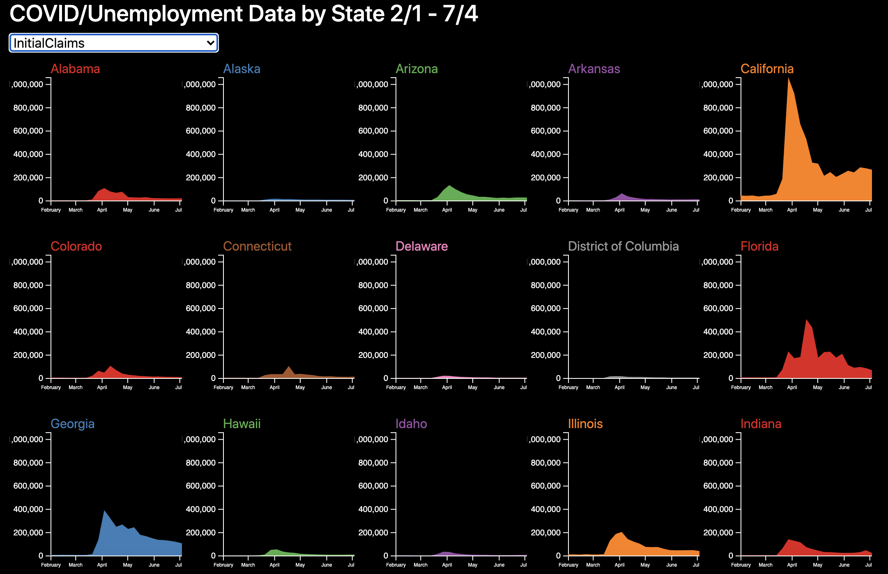
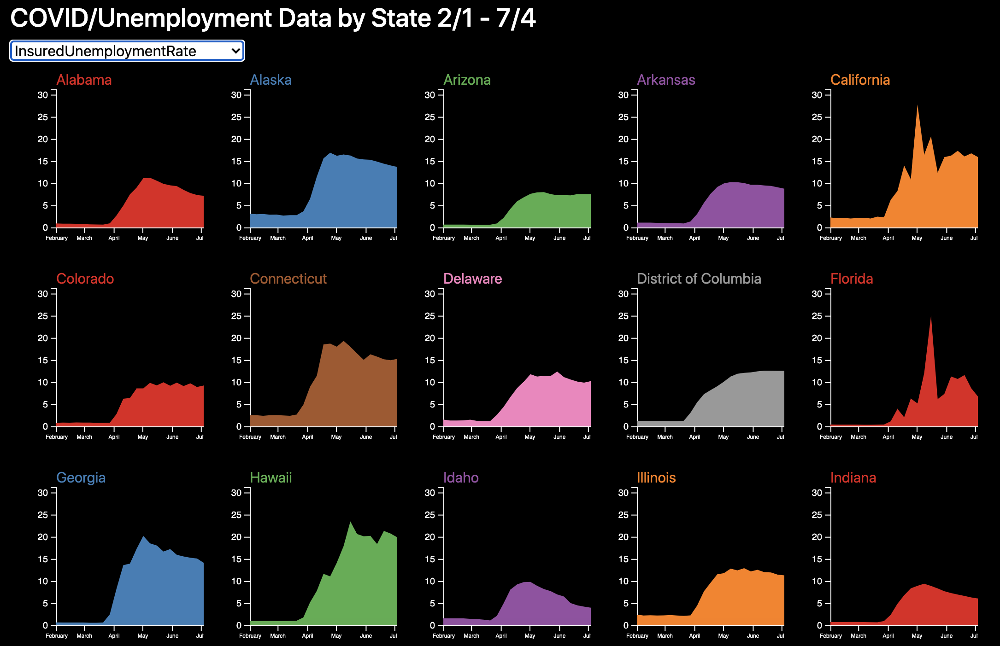
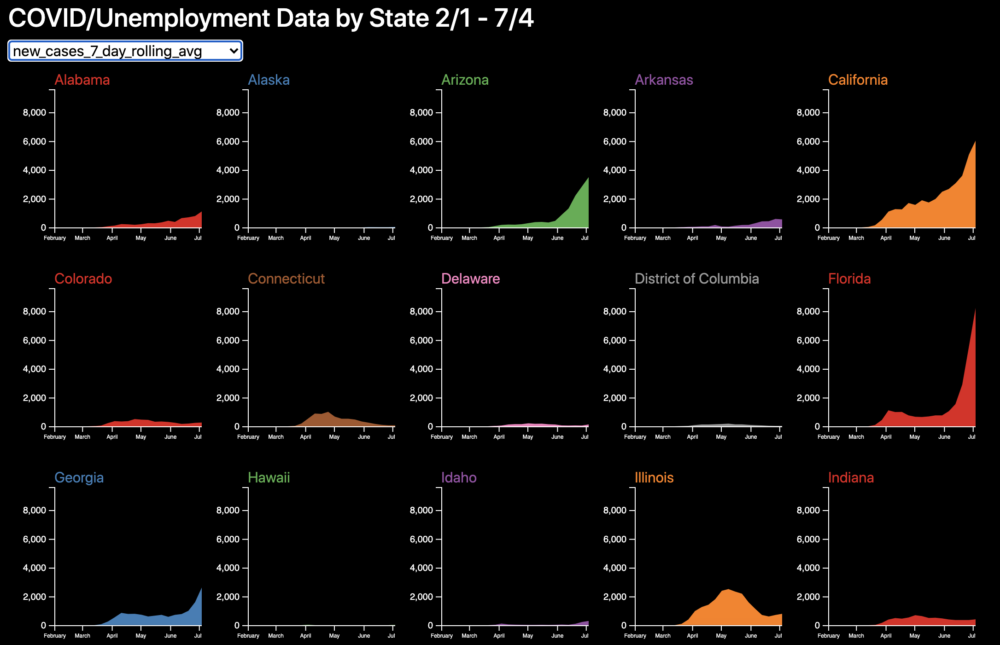

# COVID-19 Cases and Unemployment by State

#### -- Project Status: Completed

## Project Objective
The purpose of this project was to better understand the relationship between COVID-19 cases and unemployment claims across different states.  During the COVID-19 pandemic, states have used different strategies to either minimize new COVID-19 cases, or keep their businesses open.  We wanted to understand, using visualizations, if cases with high numbers of unemployment claims had fewer cases, or if there was not a relationship between COVID-19 cases and unemployment claims.

### Methods Used
* Interactive Data Visualization

### Technologies
* Python Flask
* Javascript
* D3
* SQLite
* HTML
* CSS
* Heroku

## Project Description
Data on COVID-19 cases and deaths were pulled from the Johns Hopkings COVID-19 Case Tracker, which is a public dataset on data.world used by The Associated Press' data team (https://data.world/associatedpress/johns-hopkins-coronavirus-case-tracker). We obtained unemployment claims data from the United States Department of Labor (https://oui.doleta.gov/unemploy/claims.asp).  Since unemployment data is reported once per week on Saturday, we joined the COVID-19 case data to the unemployment data on date, leaving us with just one row of data per week.  We only used 7-day rolling averages or cumulative numbers for COVID-19 cases and deaths, so as not to only include new cases and deaths that were reported on Saturdays.  Our data spanned 23 weeks, from February 1, 2020 - July 4, 2020.  As we had data for 50 states, plus the District of Columbia, our dataset was 1,173 rows.  

We decided to look at 11 different variables, which you can see on the drop-down menu [here](https://bamb-project3.herokuapp.com/).  We determined the best way to display our data would be with small multiple area charts, where data for each state is displayed with a single chart.  Then the drop-down menu is used to change the variable displayed by each chart.  Interestingly, the New York Times has used a similar format to display trajectories of COVID-19 cases by state.

We initially hypothesized that there would be relationships between new COVID-19 cases and unemployment by state.  For example, as new states had surges in COVID-19 cases, lockdowns would occur and unemployment would go up.  Or states would remain locked down, keeping unmeployment high but new COVID-19 cases low. 

When we inspected the visualizations, we did not consistently see that relationship.  There were spikes in unemployment in Apri across nearly all states as shutdowns occurred. See the figures below of initial unemployment claims.

For almost all states, unemployment stayed high into July 2020, as seen by the figures depicting insured insured unemployment rate by below.

But there were a few notable exceptions.  Florida had a large drop in their insured unemployment rate in late May (see above), and also had a subsequent jump in new COVID-19 cases in June (see below).  This example does suggest that Florida's decision to reopoen their economy, as evidenced by the drop in unemployment, may have contributed to a large rise in cases seen within the next month. 

## Deliverables
* [Application](https://bamb-project3.herokuapp.com/)
* Visit the application linked above.   Change the variable in the drop-down menu to see how states varied over time in COVID-19 cases, deaths, and new unemployment claims. 

## Team Members

|Name     |  GibHub Handle   | 
|---------|-----------------|
|Blaine Gobler | goblebla   |
|Bryan Loy | bloy86   |
|Anton Mendoza | antonmendozaxvx  |
|Maxwell Winder | thequumulox   |

## Contact
* Bryan Loy, linkedin.com/in/bryanloy

